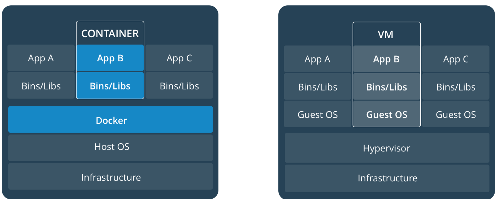
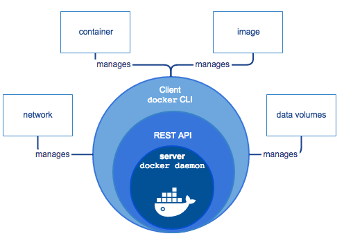

网上手册：
- https://yeasy.gitbooks.io/docker_practice/introduction/what.html
- https://www.qikqiak.com/k8s-book/docs/39.kubedns.html

### Docker vs VM


- **VM**: 利用Hypervisor等虚拟技术，使得多个虚似机能共用一套硬件， 虚似机有各自不同的操作系统。
- **Docker**: 容器技术,将开发者自己的APP及其依赖的lib封装成一个image,真正得可移植。可运行在装有docker engine的操作系统上（可以是VM）。

#### Docker Engine
> Docker Engine是一个C/S架构的应用程序，主要包含下面几个组件
- 常驻后台进程Dockerd
- 一个用来和 Dockerd 交互的 REST API Server
- 命令行CLI接口，通过和 REST API 进行交互（我们经常使用的 docker 命令）


#### Docker Registry
类似于repo.maven, 用来存储Docker images的仓库

## 以下是我的安装笔记
#### Install On Centos
1. sudo yum install -y yum-utils device-mapper-persistent-data lvm2
2. sudo yum-config-manager --add-repo https://download.docker.com/linux/centos/docker-ce.repo
3. sudo yum install docker-ce
4. sudo /sbin/usermod -aG docker irteamsu  -- if current user, need relogin
5. sudo /sbin/usermod -aG docker irteam   -- if current user, need relogin
6. mirror config: add or edit `/etc/docker/daemon.json`
```
{
  "registry-mirrors": ["https://registry.docker-cn.com"]
}
```
7. sudo systemctl enable docker   ---# enable docker engine
8. sudo systemctl restart docker
9. test install:  `docker run hello-world`

#### uninstall
1. sudo yum remove docker-ce
2. sudo rm -rf /var/lib/docker

### Troubleshooting

#### 1. docker info warning 内核参数
```
WARNING: bridge-nf-call-iptables is disabled
WARNING: bridge-nf-call-ip6tables is disabled
WARNING: IPv4 forwarding is disabled

```
```
$  sudo touch /etc/sysctl.d/60-docker.conf
$  sudo vi /etc/sysctl.d/60-docker.conf
```
net.bridge.bridge-nf-call-ip6tables = 1
net.bridge.bridge-nf-call-iptables = 1
net.ipv4.ip_forward=1 
```
$  sudo /usr/sbin/sysctl --system
```

#### 2. Docker运行即退出
>提到 CMD 就不得不提容器中应用在前台执行和后台执行的问题。这是初学者常出现的一个混淆。
Docker 不是虚拟机，容器中的应用都应该以前台执行，而不是像虚拟机、物理机里面那样，用 upstart/systemd 去启动后台服务，容器内没有后台服务的概念

#### 3. Dockerfile 调试

> 如图所示，可以运行如下命令看之前step的状态：
> docker run --it d1e884d5ed14

#### 4. ARG 失效
> 设计如此，FROM会开始一个新的build stage, 这时，new scope创建，ARG只在每个scope内，所以FROM(每个build-stages)后，要显示的申明。

#### 5. Access 404
> 检查war包的权限，必需是当前用户拥有可读可执行权限。
