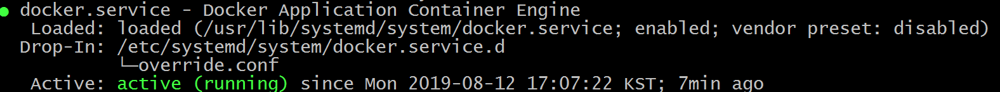

#### Docker 的最佳实践
##### 1.1 docker默认存储路径, 不要使用默认的/var/lib/docker.
>随着拉取镜像和构建的版本越来越多，可能造成disk不够用，所以存储路径需要考虑。
>在镜像未启动时均是以镜像层存储在host主机上（存储路径：/var/lib/docker/\<storage-driver\>/, centos为devicemapper, ubuntu为aufs).
>`/var/lib/docker/devicemapper/metadata` 目录下的文件（除了base、 deviceset- metadata、transaction-medatata），其余的文件都是 images 本身和 images 的中间件信息；用来描述它们的id、大小、transaction_id、以及是否initialized，并且它们大小都是一样的。
>`/var/lib/docker/devicemapper/mnt`  它主要是用来挂载 images 和 container 的目录，因为 devicemapper 本身就是通过在存储池中挂载的方式进行运行的。

##### 1.2 修改docker默认存储路径
  - sudo systemctl status docker  # 查看真实生效的docker.service配置  

  - sudo vi /etc/systemd/system/docker.service.d/override.conf  #修改该文件
```
[Service]
ExecStart=
ExecStart=/usr/bin/dockerd -g /home/myname/apps/docker -H fd:// -H tcp://0.0.0.0:12375  -H unix:///var/run/docker.sock
```

- sudo systemctl daemon-reload   # 重新加载配置
- sudo systemctl restart docker    # 重启docker
- docker info  # 查看Docker Root Dir的值是否为: /home/myname/apps/docker 
