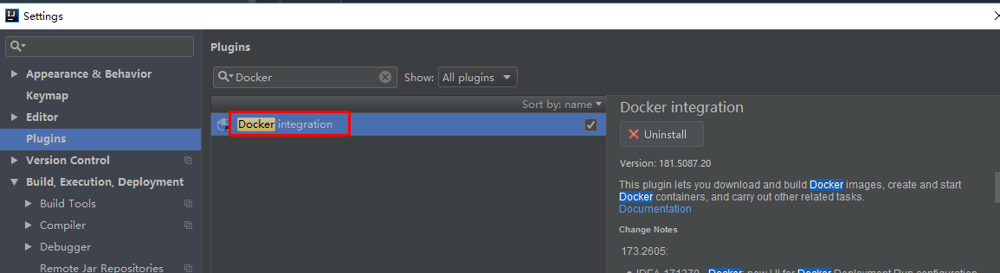
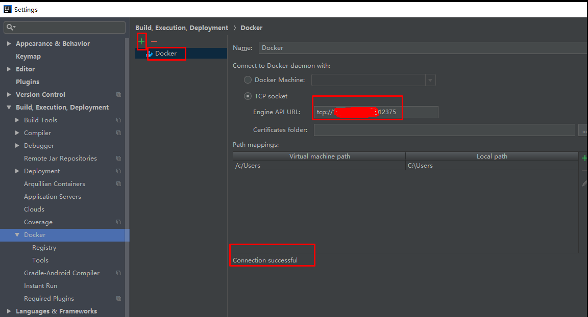
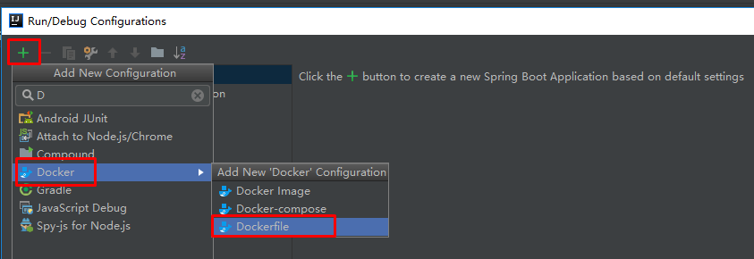
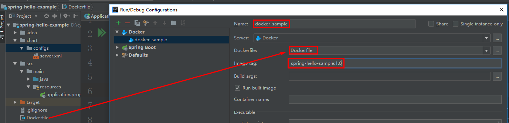
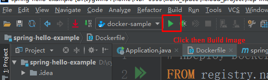
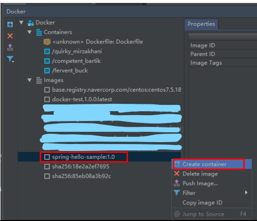
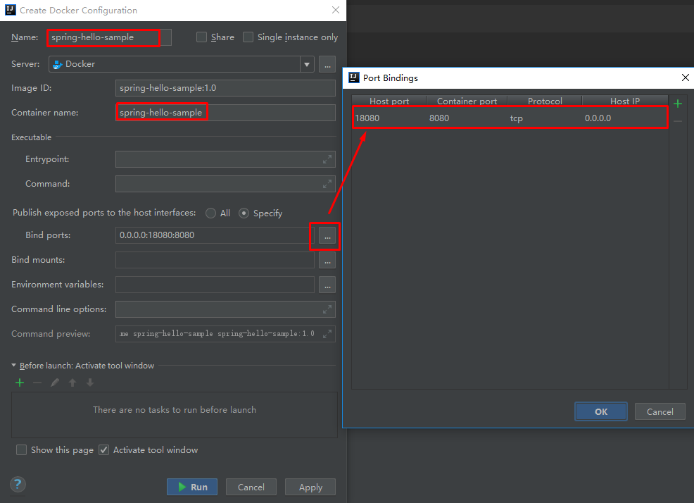

> 我并不想在本机安装docker engine, 所以采用其它VM来安装。在在本地IDEA开发中使用远程的docker engine.


## How to setup a Remote Docker Engine
1. install docker.
2.  `sudo systemctl edit docker.service`
edit file & save as below
```
[Service]
ExecStart=
ExecStart=/usr/bin/dockerd -H fd:// -H tcp://0.0.0.0:12375  -H unix:///var/run/docker.sock
```
3. restart docker.
4. check:  `sudo netstat -lntp | grep dockerd`

## Docker with IDEA
> this comments try to explain how to deploy container and test your image on remote server.

1. install Docker plugin:` File->Settings->Plugins->Install JetBrains plugin`, install `Docker integration`

2. config Docker: `File->Settings->Build,Execution,Deployment->Docker`


## Build you app image
1. setup docker builder

2. config docker builder, `Run Built images` 最好不选，只创建image

3. run docker builder to build image

4. after created image, we can create container base on it.

