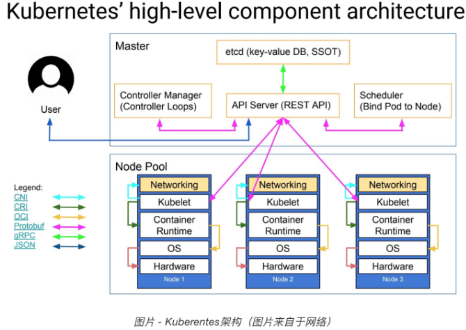
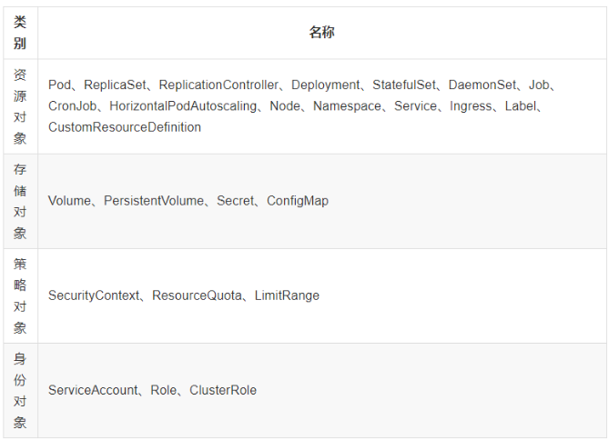

refer to: 
- https://www.huweihuang.com/kubernetes-notes/operation/kubernetes-troubleshooting.html
- https://jimmysong.io/kubernetes-handbook/concepts/flannel.html

# Kubernetes
公司产品众多，需要在集群中部署这些服务，k8s是非常合适的选择,具有以下特点：

- can scale, and do this on-demand（可扩展，并按需执行） -- Replicates 和 Resource limits
- use resources optimally（资源优化） -- HPA(Horizontal Pod Autoscaling)
- can discover other applications automatically, and communicate with each other（自动发现其它应用，相互通信） -- Services
- are accessible from the external world（可以从外部访问） -- Services
- can update/rollback without any downtime.（可以更新，回滚没有任何停机时间）-- Rolling-update

### Basic Concepts
- `Kubernetes`: 是一个自动化部署、伸缩和操作应用程序容器的开源平台。
- `Cluster`: 是计算，存储和网络资源的集合，K8S利用这些资源运行各种基于容器的应用。
- `Master`: 是cluster的大脑，主要职责是调度。即决定将应用放在哪里运行。Master同时也是一个node.
- `Node`：职责是运行应用，Node由master管理，Node负责监控并汇报容器的状态，同时根据master的要求管理容器的生命周期。
- `Pod`: **是k8s的最小工作单元**. Pod可以包含一个或多个容器，Pod中的容器作为一个整体被master调度到一个node上运行。Pod中所有的容器是共享数据卷和使用同一个网络namespace, 即相同的IP地址和Port空间。它们可以直接用localhost通信。

- `Controller`: k8s是通过controller来管理pod的，controller中定义了pod的部署特性，比如几个副本，在什么样的node上运行。
- `Service`:每个POD有自己的IP，且很可能会被频繁销毁重启，IP会变化。所以外界通过service来访问一组特定的POD， service有自己的IP和端口，且为Pod提供了负载均衡。
- `Namespace`: 在同一个cluster上，如何为多个用户和项目组同时提供隔离服务，就这是namespace，它将一个物理的cluster逻辑上分成多个虚拟的cluster，每一个cluster就是一个namespace, 不同namespace里的资源是完全隔离的。

> k8s默认创建了两个Namespace, `kubectl get namespace`, 可以看到
- default:用户默认创建资源在这里。
- kube-system: k8s自己创建的系统资源在这个namespace中。

### K8s的工具
- `kubelet`:运行在cluster所有节点上，负责启动pod和容器。
- `kubeadm`: 用于初始化cluster.
- `kubectl`: 是k8s的命令行工具，通过它可以部署和管理应用，查看各种资源，创建，删除和更新各种组件。

### Cluster Architecture

- kube-proxy
service 在逻辑上代表了后端的多个Pod，外界通过service访问Pod, Service接收到请求，通过kube-proxy 这个代理转发请求到Pod, 如果有多个副本，kube-proxy会实现负载均衡。
- API Server（kube-apiserver）
他提供http/https restful api, 是kubernetes cluster的前端接口，各种客户端工具CLI以及k8s其它组件可以通过它管理Cluster的各种资源。
- Scheduler (kube-scheduler)
scheduler 考虑各个节点的负截，负责决定Pod放在哪个node上运行。
- Controller Manager(kube-controller-manager)
负责管理Cluster的各种资源，保证资源处于预期的状态。Controller Mgr由多种controller组成，管理不同资源。
- etcd
负责保存k8s的配置信息和各种资源的状态信息，当数据发生变化时，etcd会快速地通知k8s相关组件。

## K8S 常用命令
> 首先记住以下k8s的资源对象, 命令分几类，作用在这些对象上
ref: https://kubernetes.io/docs/reference/kubectl/cheatsheet



#### Conext & Config
```
kubectl config view # Show Merged kubeconfig settings.
```
#### Createing Objects
> kubectl apply vs kubectl create?
> - `kubectl create` is what we call Imperative Management. On this approach you tell the Kubernetes API what you want to create, replace or delete, not how you want your K8s cluster world to look like.will 
throw an error if the resource already exists.
> - `kubectl apply` is part of the Declarative Management approach, where changes that you may have applied to a `live` object (i.e. through scale) are maintained even if you apply other changes to the object.

```
kubectl apply -f ./my-manifest.yaml           # create resource(s)
kubectl apply -f ./my1.yaml -f ./my2.yaml     # create from multiple files
kubectl apply -f ./dir                        # create resource(s) in all manifest files in dir
kubectl apply -f https://git.io/vPieo         # create resource(s) from url
kubectl create deployment nginx --image=nginx  # start a single instance of nginx
kubectl explain pods,svc                       # get the documentation for pod and svc manifest
```

#### Viewing, Finding Resources
```
# Get commands with basic output
kubectl get services                          # List all services in the namespace
kubectl get pods --all-namespaces             # List all pods in all namespaces
kubectl get pods -o wide                      # List all pods in the namespace, with more details
kubectl get deployment my-dep                 # List a particular deployment
kubectl get pods --include-uninitialized      # List all pods in the namespace, including uninitialized ones
kubectl get pod my-pod -o yaml                # Get a pod's YAML
kubectl get pod my-pod -o yaml --export       # Get a pod's YAML without cluster specific information

# Describe commands with verbose output
kubectl describe nodes my-node
kubectl describe pods my-pod
kubectl get services --sort-by=.metadata.name # List Services Sorted by Name
```

#### Deleting Resources
```
kubectl delete -f ./pod.json                                              # Delete a pod using the type and name specified in pod.json
kubectl delete pod,service baz foo                                        # Delete pods and services with same names "baz" and "foo"
kubectl delete pods,services -l name=myLabel                              # Delete pods and services with label name=myLabel
kubectl delete pods,services -l name=myLabel --include-uninitialized      # Delete pods and services, including uninitialized ones, with label name=myLabel
kubectl -n my-ns delete po,svc --all                                      # Delete all pods and services, including uninitialized ones, in namespace my-ns,
# Delete all pods matching the awk pattern1 or pattern2
kubectl get pods  -n mynamespace --no-headers=true | awk '/pattern1|pattern2/{print $1}' | xargs  kubectl delete -n mynamespace pod
```

#### Interacting with running Pods
```
kubectl logs my-pod                                 # dump pod logs (stdout)
kubectl logs -l name=myLabel                        # dump pod logs, with label name=myLabel (stdout)
kubectl logs my-pod --previous                      # dump pod logs (stdout) for a previous instantiation of a container
kubectl logs my-pod -c my-container                 # dump pod container logs (stdout, multi-container case)
kubectl logs -l name=myLabel -c my-container        # dump pod logs, with label name=myLabel (stdout)
kubectl logs my-pod -c my-container --previous      # dump pod container logs (stdout, multi-container case) for a previous instantiation of a container
kubectl logs -f my-pod                              # stream pod logs (stdout)
kubectl logs -f my-pod -c my-container              # stream pod container logs (stdout, multi-container case)
kubectl logs -f -l name=myLabel --all-containers    # stream all pods logs with label name=myLabel (stdout)
kubectl run -i --tty busybox --image=busybox -- sh  # Run pod as interactive shell
kubectl attach my-pod -i                            # Attach to Running Container
kubectl port-forward my-pod 5000:6000               # Listen on port 5000 on the local machine and forward to port 6000 on my-pod
kubectl exec my-pod -- ls /                         # Run command in existing pod (1 container case)
kubectl exec my-pod -c my-container -- ls /         # Run command in existing pod (multi-container case)
kubectl top pod POD_NAME --containers               # Show metrics for a given pod and its containers
```

#### Interacting with Nodes and Cluster
```
kubectl cordon my-node                                                # Mark my-node as unschedulable
kubectl drain my-node                 # 优雅的结束节点上的所有 pod 并同时标记节点为不可调度 为了维护节点，Drain my-node in preparation for maintenance
kubectl drain my-node --force --ignore-daemonsets   #存在不是通过ReplicationController, ReplicaSet, Job, DaemonSet 或者StatefulSet创建的Pod（即静态pod，通过文件方式创建的），所以需要设置强制执行的参数--force,存在DaemonSet方式管理的Pod，需要设置--ignore-daemonsets参数忽略报错
kubectl uncordon my-node                                              # Mark my-node as schedulable
kubectl top node my-node                                              # Show metrics for a given node
kubectl describe nodes dev-ncc-slave-1-ncl              # inspect node info
kubectl cluster-info                                                  # Display addresses of the master and services
kubectl cluster-info dump                                             # Dump current cluster state to stdout
kubectl cluster-info dump --output-directory=/path/to/cluster-state   # Dump current cluster state to /path/to/cluster-state

# If a taint with that key and effect already exists, its value is replaced as specified.
kubectl taint nodes foo dedicated=special-user:NoSchedule
```
