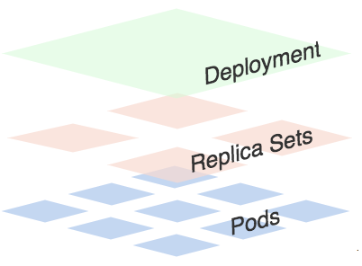
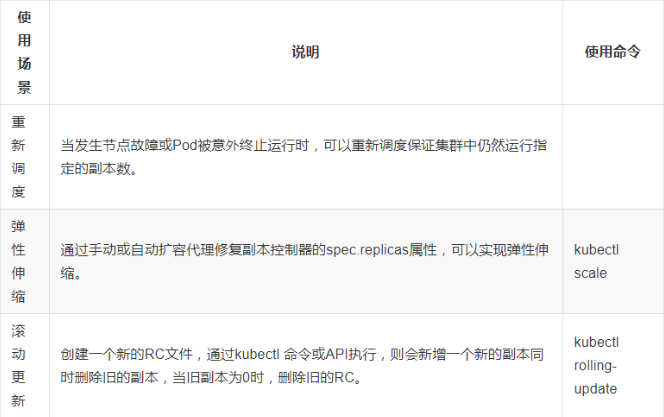

> 更推荐更用 `Deployment` 来自动管理`ReplicaSet`, ReplicationController 新版本不建议再使用。
> 一个Deployment控制多个ReplicaSet主要是为了支持回滚机制，每当Deployment操作时，Kubernetes会重新生成一个Replica Set并保留，以后有需要的话就可以回滚至之前的状态。

#### 职责
- 确保集群中有且仅有N个Pod实例，N是定义的Pod副本数量。
- 通过调整spec.replicas属性值来实现系统扩容或缩容。
- 通过改变Pod模板来实现系统的滚动升级。


> 可以看出一个Deployment拥有多个Replica Set，而一个Replica Set拥有一个或多个Pod。一个Deployment控制多个rs主要是为了支持回滚机制，每当Deployment操作时，Kubernetes会重新生成一个Replica Set并保留，以后有需要的话就可以回滚至之前的状态。



#### Replication Set（RS）
```
#以下两个都显示POD的副本数量
kubectl get rs    # 包括历史数据
kubectl get deployment   # 只显示在用的
```

#### Deployment 应用场景：stateless
- 定义Deployment来创建Pod和ReplicaSet
- 滚动升级和回滚应用
- 扩容和缩容
- 暂停和继续Deployment
#### StatefulSet 应用场景
- 稳定的持久化存储，即Pod重新调度后还是能访问到相同的持久化数据，基于PVC来实现
- 稳定的网络标志，即Pod重新调度后其PodName和HostName不变，基于Headless Service（即没有Cluster IP的Service）来实现
- 有序部署，有序扩展，即Pod是有顺序的，在部署或者扩展的时候要依据定义的顺序依次依次进行（即从0到N-1，在下一个Pod运行之前所有之前的Pod必须都是Running和Ready状态），基于init containers来实现
- 有序收缩，有序删除（即从N-1到0）
#### DaemonSet 应用场景：DaemonSet 确保全部（或者一些）Node 上运行一个 Pod 的副本。
- 运行集群存储 daemon，例如在每个 Node 上运行 glusterd、ceph。
- 在每个 Node 上运行日志收集 daemon，例如fluentd、logstash。
- 在每个 Node 上运行监控 daemon，例如 Prometheus Node Exporter、collectd、Datadog 代理、New Relic 代理，或 Ganglia gmond

### my-nginx deployment文件举例
> my-nginx.yaml

```yaml
apiVersion: apps/v1
kind: Deployment
metadata:
  name: my-nginx-deployment  #deployments的名字
spec:
  selector:      #required feild
    matchLabels:
      app: my-nginx        # 此处label的key&value必需和template的labels保持一致
  replicas: 1
  template:
    metadata:
      labels:
        app: my-nginx
    spec:
      containers:
        - name: my-nginx
          image: registry.mycorp.com/image/my-nginx:latest
          ports:
            - containerPort: 80
```

### 滚动更新 Rolling-update 
> 滚动更新，是指一次只更新一小部份副本，成功后再更新更多的副本，最终完成全部更新。保证了零停机。`.spec.strategy` 指定新的Pod替换旧的Pod的策略。 .spec.strategy.type 可以是"Recreate"或者是 "RollingUpdate"。"RollingUpdate"是默认值。·.spec.strategy.type==Recreate·时，在创建出新的Pod之前会先杀掉所有已存在的Pod。
> 注意： Deployment 的 rollout 当且仅当Deployment 的 pod template（例如.spec.template）中的label更新或者镜像更改时被触发。其他更新，例如扩容Deployment不会触发 rollout.当修改deployment资源，再次执行
`kubectl apply -f my-nginx.yaml --record` 时会滚动更新, --record会记录命令。

```
kubectl rollout status  # 命令监控 Deployment 的进度
```

### 回滚
"当修改deployment资源，再次执行`kubectl apply -f` 时会生成新的RS，默认配置下，保留最近2个revision, 可以在`Deployment`配置文件中通过revisionHistoryLimit属性增加revision数量，如下查看RS集：
```terminal
[irteam@dev-ncc-client-ncl ~]$ kubectl get rs -o wide
NAME                              DESIRED   CURRENT   READY   AGE    CONTAINERS   IMAGES                                              SELECTOR
curl-6bf6db5c4f                   1         1         1       3d7h   curl         radial/busyboxplus:curl                             pod-template-hash=6bf6db5c4f,run=curl
my-nginx-deployment-664b858f8b   1         1         1       47h    my-nginx    registry.mycorp.com/image/my-nginx:latest   app=my-nginx,pod-template-hash=664b858f8b
my-nginx-deployment-fcd5699d8    0         0         0       2d     my-nginx    registry.mycorp.com/image/my-nginx:latest   app=my-nginx,pod-template-hash=fcd5699d8
```
##### 1. 通过`kubectl rollout history deployment my-nginx-deployment`查看revision
```terminal
[irteam@dev-ncc-client-ncl ~]$ kubectl rollout history deployment my-nginx-deployment
deployment.extensions/my-nginx-deployment
REVISION  CHANGE-CAUSE
1         <none>
2         <none>
```
##### 2. 查看单个`revision`的详细信息：
```
kubectl rollout history deployment my-nginx-deployment --revision=1
```
##### 3. 回退到历史版本(同时也会生成新的revision)：
```
kubectl rollout undo deployment my-nginx-deployment  #回退到这之前的版本
kubectl rollout undo deployment my-nginx-deployment --to-revision=2  #回退到指定的历史版本
```
##### 4. 验证：
`kubectl describe deployment` or `kubectl get rs -o wide`
```
[irteam@dev-ncc-client-ncl deployments]$ kubectl get rs -o wide
NAME                              DESIRED   CURRENT   READY   AGE    CONTAINERS   IMAGES                                              SELECTOR
curl-6bf6db5c4f                   1         1         1       3d8h   curl         radial/busyboxplus:curl                             pod-template-hash=6bf6db5c4f,run=curl
my-nginx-deployment-664b858f8b   0         0         0       47h    my-nginx    registry.mycorp.com/image/my-nginx:latest   app=my-nginx,pod-template-hash=664b858f8b
my-nginx-deployment-fcd5699d8    1         1         1       2d1h   my-nginx    registry.mycorp.com/image/my-nginx:latest   app=my-nginx,pod-template-hash=fcd5699d8
```
> 注意: 回滚后, 会生成新的revision
> 注意：只要 Deployment 的 rollout 被触发就会创建一个 revision。也就是说当且仅当 Deployment 的 Pod template（如.spec.template）被更改，例如更新template 中的 label 和容器镜像时，就会创建出一个新的 revision。

### HPA(Horizontal Pod Autoscaling)
> Pod 水平自动伸缩，HAP通过监控RC或者Deployment控制的所有Pod的负载变化来确定是否需要调整pod的副本数量。 HPA是一个controller资源对象，Controller 会根据监测到用户指定的目标的 CPU 利用率周期性得调整 replication controller 或 deployment 的 replica 数量。

### 使用kubectl管理 HPA
>Horizontal Pod Autoscaling作为API resource也可以像Pod、Deployment一样使用kubeclt命令管理，使用方法跟它们一样，资源名称为hpa.

```
kubectl create hpa
kubectl get hpa
kubectl describe hpa
kubectl delete hpa
# 直接命令行创建HPA:
kubectl autoscale (-f FILENAME | TYPE NAME | TYPE/NAME) [--min=MINPODS] --max=MAXPODS
[--cpu-percent=CPU] [flags] [options]
# 例如：
kubectl autoscale deployment foo --min=2 --max=5 --cpu-percent=80
```


