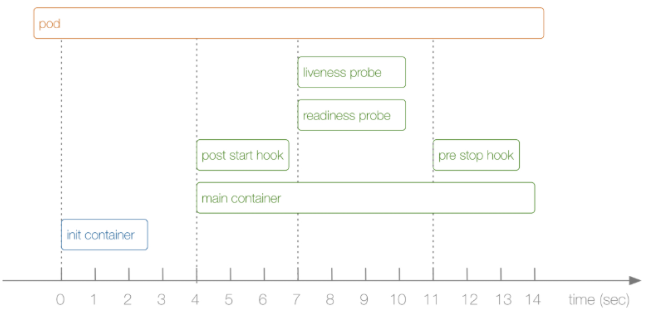
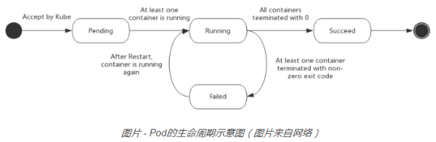

> Pod是kubernetes中你可以创建和部署的最小也是最简的单位。Pod代表着集群中运行的进程.Pod不会自愈。如果Pod运行的Node故障，或者是调度器本身故障，这个Pod就会被删除. `我们很少会直接在k8s中创建Pod`,因为Pod的生命周期是短暂的，用后即焚的实体

#### Pod和Controller
> Controller可以创建和管理多个Pod，提供副本管理、滚动升级和集群级别的自愈能力。例如，如果一个Node故障，Controller就能自动将该节点上的Pod调度到其他健康的Node上.以下ReplicationController里的会根据我们的YAML文件里的pod template来创建Pod.

- ReplicationController
   - Deployment
   - StatefulSet
   - Daemonset
- NamespaceController
   - Namespace

#### Pod Templates
>Pod模版是包含了其他object的Pod定义，例如Replication Controllers，Jobs和 DaemonSets。Controller根据Pod模板来创建实际的Pod. 参与一个实际的template:https://jimmysong.io/kubernetes-handbook/manifests/template/pod-v1-template.yaml

#### Pod的持久性（或者说缺乏持久性）
> Pod在设计支持就不是作为持久化实体的。在调度失败、节点故障、缺少资源或者节点维护的状态下都会死掉会被驱逐。

#### Pod的终止
用户可以发送指令终止：
`kubectl delete pod ${podName}`
 `kubectl delete pod ${podName}  --force  --grace-period=0 `
> 0表示强制删除，也可以加时间，默认`所有的优雅退出时间都在30秒内`

示例流程如下：
1. 用户发送删除pod的命令，默认宽限期是30秒；
2. 在Pod超过该宽限期后API server就会更新Pod的状态为“dead”；
3. 在客户端命令行上显示的Pod状态为“terminating”；
4. 跟第三步同时，当kubelet发现pod被标记为“terminating”状态时，开始停止pod进程：
     4.1 如果在pod中定义了preStop hook，在停止pod前会被调用。如果在宽限期过后，preStop hook依然在运行，第二步会再增加2秒的宽限期；
     4.2  向Pod中的进程发送TERM信号；
5. 跟第三步同时，该Pod将从该service的端点列表中删除，不再是replication controller的一部分。关闭的慢的pod将继续处理load balancer转发的流量；
6. 过了宽限期后，将向Pod中依然运行的进程发送SIGKILL信号而杀掉进程。
7. Kubelet会在API server中完成Pod的的删除，通过将优雅周期设置为0（立即删除）。Pod在API中消失，并且在客户端也不可见。

下图来自网络：

#### POD 的生命周期
- 挂起（Pending）：Pod 已被 Kubernetes 系统接受，但有一个或者多个容器镜像尚未创建。等待时间包括调度 Pod 的时间和通过网络下载镜像的时间，这可能需要花点时间。
- 运行中（Running）：该 Pod 已经绑定到了一个节点上，Pod 中所有的容器都已被创建。至少有一个容器正在运行，或者正处于启动或重启状态。
- 成功（Succeeded）：Pod 中的所有容器都被成功终止，并且不会再重启。
- 失败（Failed）：Pod 中的所有容器都已终止了，并且至少有一个容器是因为失败终止。也就是说，容器以非0状态退出或者被系统终止。
- 未知（Unknown）：因为某些原因无法取得 Pod 的状态，通常是因为与 Pod 所在主机通信失败

